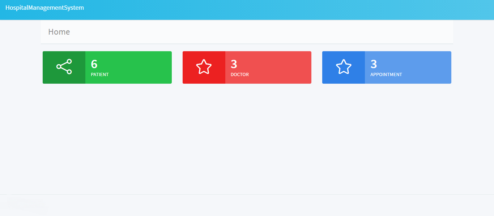
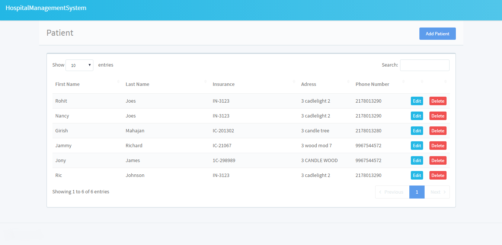
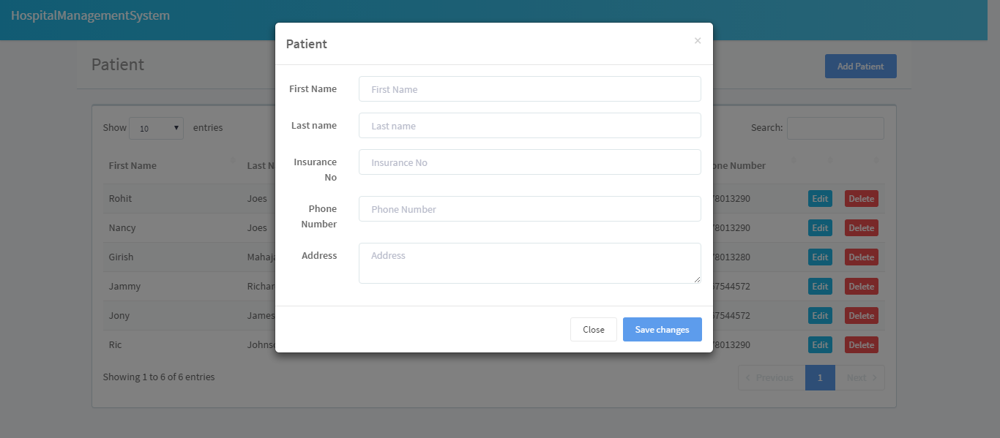
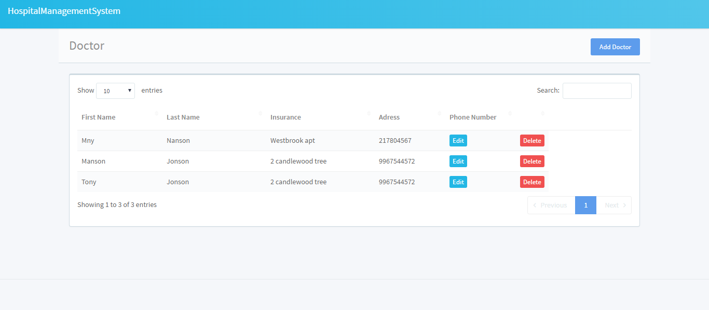
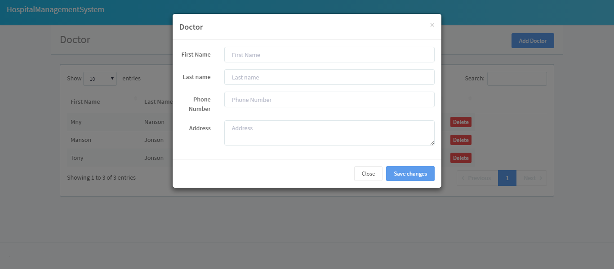
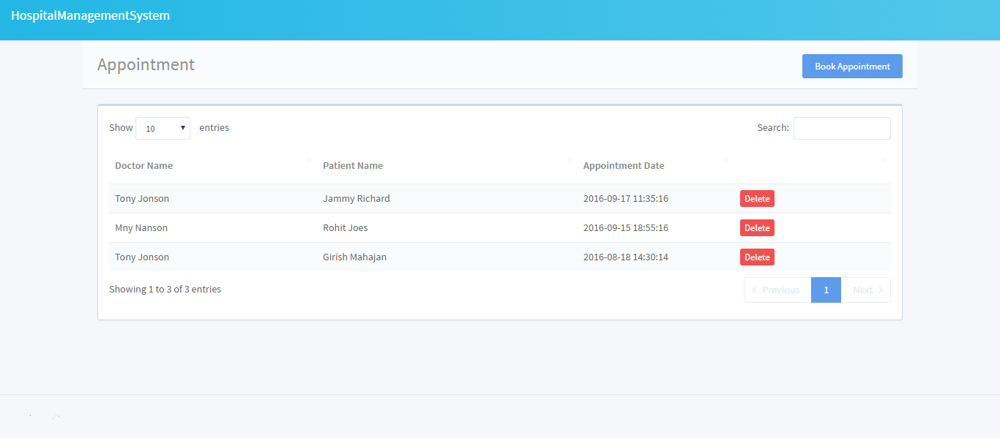
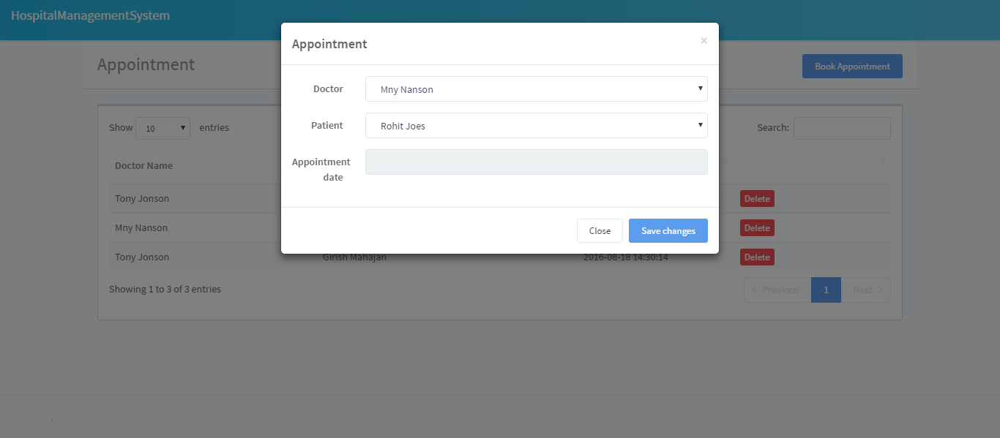

# Hospital Management System


## Getting Started

Instruction

```sh
python app.py
```


## Configure

```json
{
  "database": "database.db",
  "port": 5000,
  "host": "127.0.0.1"
}
```


## screenshot

<a href="../../" target="_blank">
<a href="../../" target="_blank">
<a href="../../" target="_blank">
<a href="../../" target="_blank">
<a href="../../" target="_blank">
<a href="../../" target="_blank">
<a href="../../" target="_blank">


